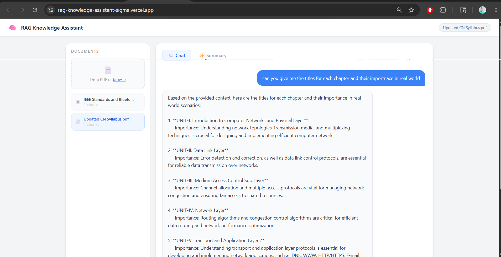
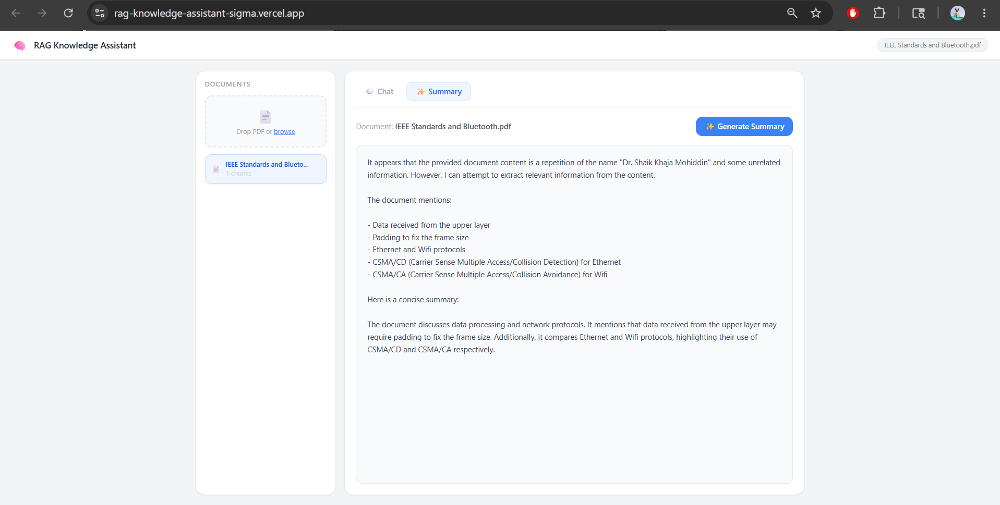

# 🧠 RAG Knowledge Assistant

A full-stack AI-powered document assistant that allows users to upload PDFs, ask context-aware questions, and generate intelligent summaries using a Retrieval-Augmented Generation (RAG) pipeline.

🔗 **Live Demo:** [https://rag-knowledge-assistant-sigma.vercel.app/](https://rag-knowledge-assistant-sigma.vercel.app/)

⚙️ **Backend API:** [https://rag-knowledge-assistant-zpwr.onrender.com/docs](https://rag-knowledge-assistant-zpwr.onrender.com/docs)

---

## ✨ Features

* 📄 Upload and index PDF documents instantly
* 💬 Chat with uploaded documents using semantic retrieval
* ✨ Generate concise AI-powered document summaries
* 📚 Support for multiple uploaded documents
* 🧠 Context-aware answers grounded in uploaded PDFs
* 🔍 Semantic search using ChromaDB vector database
* ⚡ Fast inference using Groq LLM
* 🗑️ Delete and manage indexed document collections
* 🌐 Fully deployed full-stack architecture using Vercel + Render
* 📱 Responsive and modern user interface

---

## 🏗️ Architecture

```text
Frontend (React + Vite)
        ↓
Backend API (FastAPI)
        ↓
PDF Parsing + Chunking
        ↓
ChromaDB Vector Store
        ↓
ONNX Embedding Generation
        ↓
Semantic Retrieval
        ↓
Groq LLM Response Generation
```

| Layer            | Technology                                         |
| ---------------- | -------------------------------------------------- |
| Frontend         | React, Vite, Tailwind CSS                          |
| Backend          | FastAPI, Python                                    |
| Vector Database  | ChromaDB (persistent vector database)              |
| Embeddings       | ChromaDB `DefaultEmbeddingFunction` (ONNX Runtime) |
| LLM              | Groq — `llama-3.1-8b-instant`                      |
| Frontend Hosting | Vercel                                             |
| Backend Hosting  | Render                                             |

---

## 🗂️ Project Structure

```text
RAG-Knowledge-Assistant/
│
├── backend/
│   ├── main.py                  # FastAPI routes and API setup
│   ├── requirements.txt
│   ├── runtime.txt
│   ├── chroma_db/               # Persistent vector database
│   ├── uploaded_pdfs/
│   └── rag_pipeline/
│       ├── pdf_parser.py        # PDF text extraction
│       ├── chunker.py           # Text chunking logic
│       ├── vector_store.py      # ChromaDB operations
│       ├── retriever.py         # Semantic retrieval
│       └── llm.py               # Groq LLM integration
│
├── frontend/
│   ├── src/
│   │   ├── App.jsx
│   │   ├── api/
│   │   ├── components/
│   │   │   ├── UploadPanel.jsx
│   │   │   ├── ChatPanel.jsx
│   │   │   ├── SummaryPanel.jsx
│   │   │   └── MessageBubble.jsx
│   │   └── pages/
│   └── vite.config.js
│
└── README.md
```

---

## ⚙️ How the RAG Pipeline Works

1. User uploads a PDF document
2. PDF text is extracted using pdfplumber
3. Text is split into overlapping chunks
4. ChromaDB generates vector embeddings using ONNX Runtime
5. Embeddings are stored persistently in the vector database
6. User asks a question about the document
7. Most relevant chunks are retrieved semantically
8. Retrieved context is sent to Groq LLM
9. AI generates context-aware grounded response

---

## 🚀 Running Locally

### Prerequisites

* Python 3.11+
* Node.js 18+
* Groq API Key

---

## Backend Setup

### 1️⃣ Navigate to Backend

```bash
cd backend
```

### 2️⃣ Create Virtual Environment

```bash
python -m venv venv
```

### Windows

```bash
venv\Scripts\activate
```

### Mac/Linux

```bash
source venv/bin/activate
```

---

### 3️⃣ Install Dependencies

```bash
pip install -r requirements.txt
```

---

### 4️⃣ Create `.env`

```env
GROQ_API_KEY=your_groq_api_key_here
```

---

### 5️⃣ Run Backend

```bash
uvicorn main:app --host 0.0.0.0 --port 8000 --reload
```

Backend runs at:

```text
http://localhost:8000
```

Swagger API Docs:

```text
http://localhost:8000/docs
```

---

## Frontend Setup

### 1️⃣ Navigate to Frontend

```bash
cd frontend
```

### 2️⃣ Install Dependencies

```bash
npm install
```

### 3️⃣ Create `.env`

```env
VITE_API_URL=http://localhost:8000
```

### 4️⃣ Run Frontend

```bash
npm run dev
```

Frontend runs at:

```text
http://localhost:5173
```

---

## 🌐 Deployment

## Backend Deployment — Render

### Build Command

```bash
pip install -r requirements.txt
```

### Start Command

```bash
uvicorn main:app --host 0.0.0.0 --port $PORT
```

### runtime.txt

```text
python-3.11.9
```

### Environment Variables

```env
GROQ_API_KEY=your_groq_api_key_here
```

---

## Frontend Deployment — Vercel

### Environment Variables

```env
VITE_API_URL=https://rag-knowledge-assistant-zpwr.onrender.com
```

### Important Notes

* Do not add trailing slash in backend URL
* Redeploy frontend after updating environment variables
* Ensure backend URL is added in FastAPI `allow_origins`

Example:

```python
allow_origins=[
    "http://localhost:5173",
    "https://rag-knowledge-assistant-sigma.vercel.app"
]
```

---

## 🔌 API Endpoints

| Method | Endpoint                       | Description                          |
| ------ | ------------------------------ | ------------------------------------ |
| GET    | `/`                            | Health check                         |
| POST   | `/upload`                      | Upload and index PDF                 |
| POST   | `/ask`                         | Ask questions from uploaded document |
| POST   | `/summarize`                   | Generate AI summary                  |
| GET    | `/documents`                   | List indexed documents               |
| DELETE | `/documents/{collection_name}` | Delete document collection           |

---

## ⚠️ Key Technical Decisions

### Lightweight ONNX Embeddings Instead of PyTorch

ChromaDB's `DefaultEmbeddingFunction` uses ONNX Runtime instead of PyTorch-based sentence-transformers.

Benefits:

* lower memory usage
* faster deployment
* Render free-tier compatibility
* no heavy transformer dependencies

This optimization helped the application run successfully within Render's 512MB free-tier memory limit.

---

### Groq Used for LLM Inference Only

Groq powers:

* question answering
* document summarization

using:

```text
llama-3.1-8b-instant
```

Embeddings are handled locally through ONNX-based ChromaDB embeddings.

---

### Deployment Challenges Solved

Key engineering optimizations implemented:

* removed PyTorch and sentence-transformers
* replaced heavy embeddings with ONNX Runtime
* optimized Render deployment for low memory usage
* fixed Vercel environment variable configuration
* solved CORS deployment issues
* reduced chunk size for faster indexing and retrieval
* preloaded embedding model during backend startup to reduce cold-start latency

---

### Per-Document Chat Memory

Frontend maintains separate chat history for each uploaded document using React state keyed by `collection_name`.

This allows users to:

* switch between documents
* preserve independent conversations
* continue chats without losing context

---

## 📸 Screenshots

### Upload & Chat Interface



### AI Summary Feature



---

## 🎯 Future Improvements

* Multi-file semantic search
* Streaming AI responses
* Authentication system
* Persistent chat history database
* Support for DOCX and TXT files
* Highlight citations from source chunks
* Cloud vector database integration

---

## 👨‍💻 Author

Mohan Kalyan Guntupalli

